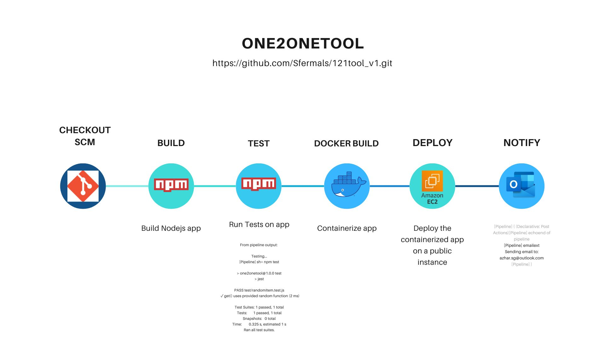
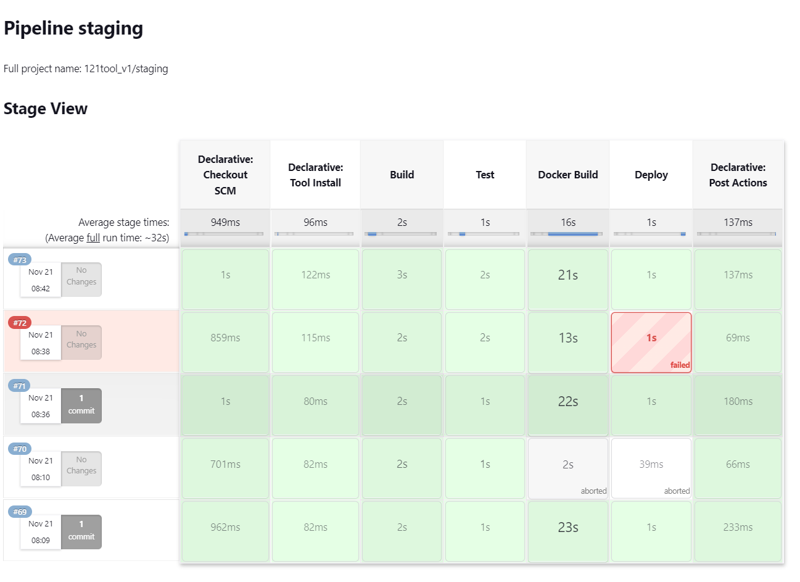
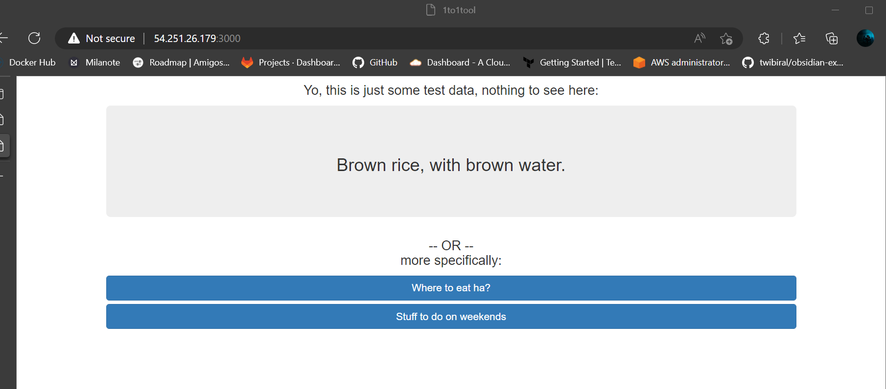
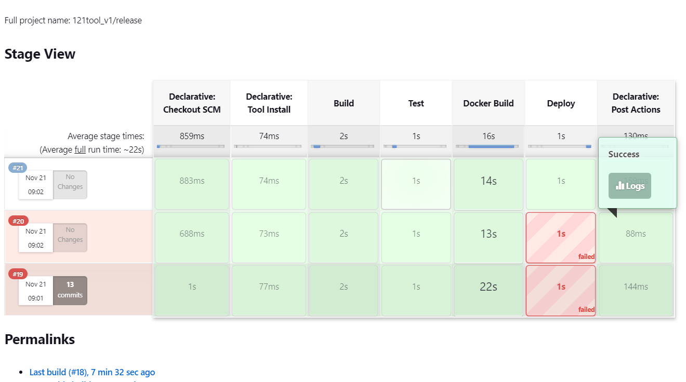
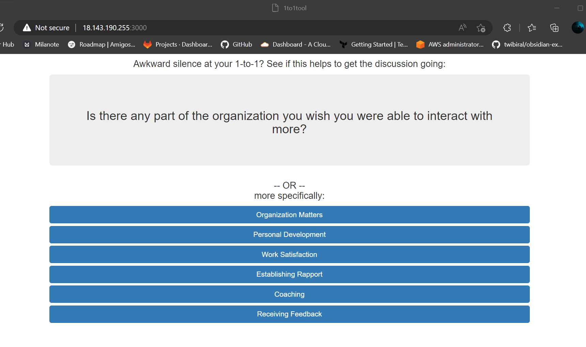

# 121TOOL_v1

As per requirenment, application makes use of a built-in JSON data file, whose filename can be
specified in the “DATA_FILE” environment variable. If the environment variable is not
found, then it will default to using “Questions.json”.

a. The “staging” branch should use “Questions-test.json” as its input
datafile

b. The “release” branch should use “Questions.json” as its input datafile

CI/CD ran in jenkins:

https://sfermals.app/

